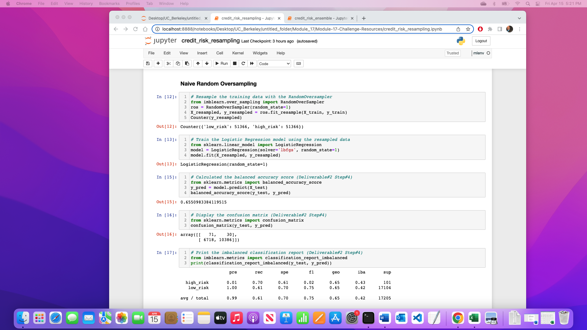
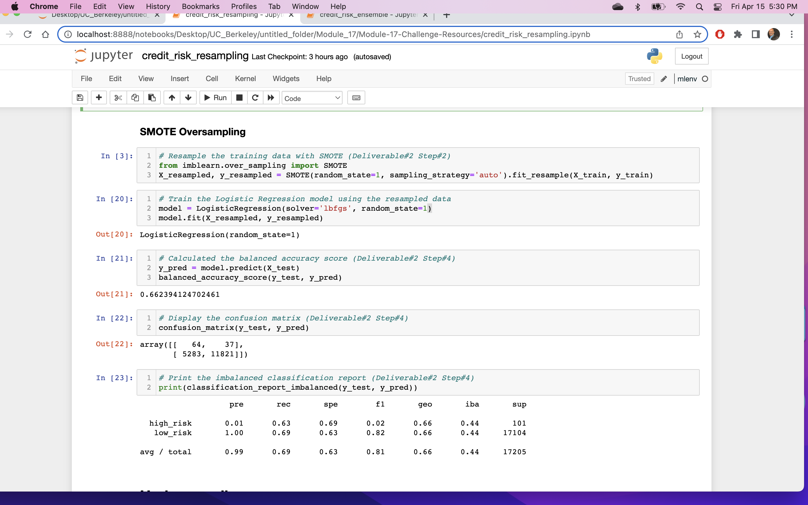
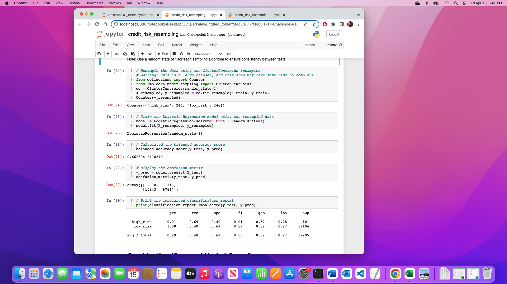
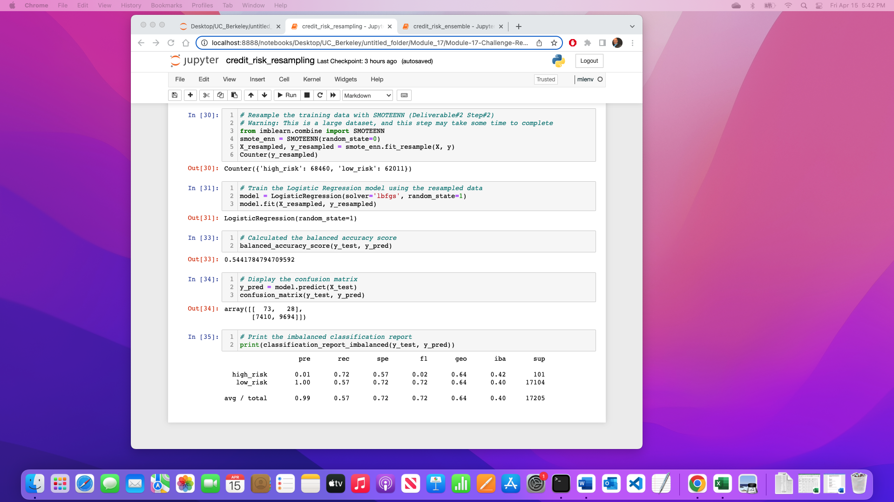
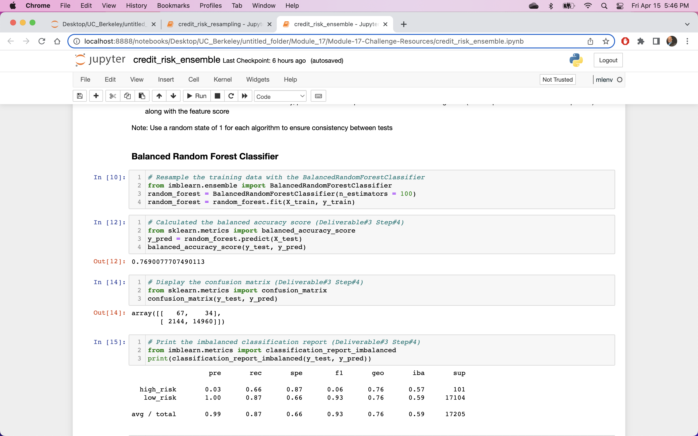
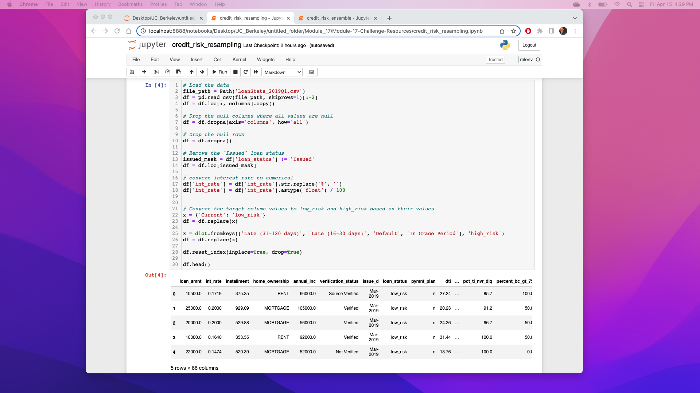
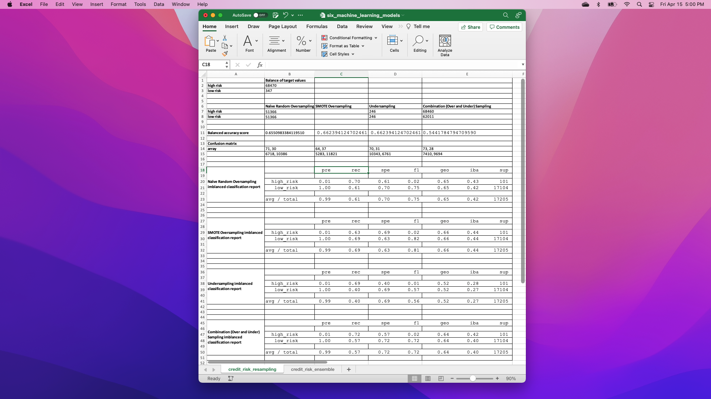
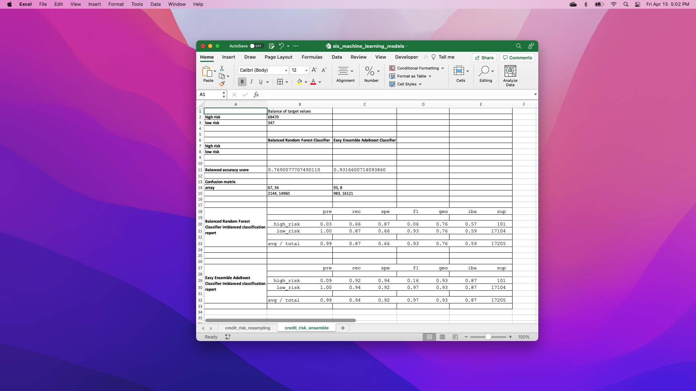

# Credit_Risk_Analysis

## Overview of the analysis: 
The purpose of this analysis is, all over the world people borrow money to purchase homes, cars or start businesses. Loans are an essential part of modern society. Loans presents an opportunity and challenge to banks and other loan institution.  On one hand it will increase revenue from the interest it generates, on the other hand it is taking risk that the borrower won’t repay loans amount and banks will lose money.   Banks are traditional relying on income, credit scores and assets, but the rise of the finical technology (FINTECH) as an enable to use the machine learning to analyze risk.
In 2019, more than 19 million Americans had at least one unsecured personal loan. That's a record-breaking number! Personal lending is growing faster than credit card, auto, mortgage, and even student debt. With such incredible growth, FinTech firms are storming ahead of traditional loan processes. By using the latest machine learning techniques, these FinTech firms can continuously analyze large amounts of data and predict trends to optimize lending.

## Keeping the same format just change the file name per ‘Deliverable:1' and 'Deliverable:2’ of provided ‘credit_risk_resampling_starter_code.ipynb’ and ‘credit_risk_ensemble_starter_code.ipynb’ complete entering codes at “YOUR CODE HERE”.

## Resources: 
Data Source – LoanStarts_2019.csv
Software – Python 3.9.7, Conda 4.12.0, Jupter Notebook 6.4.5

## Results:

### Credit Risk Resampling

## Random Over Sampler
Accuracy Score: 65.5%
Precision High Risk: 1%
Precision Low Risk: 100%
Recall High Risk: 70%
Recall Los Risk: 61%

## SMOTE Oversampling
Accuracy Score: 66.2%
Precision High Risk: 1%
Precision Low Risk: 100%
Recall High Risk: 63%
Recall Los Risk: 69%

## ClusterCentroids resampler
Accuracy Score: 66.2%
Precision High Risk: 1%
Precision Low Risk: 100%
Recall High Risk: 69%
Recall Los Risk: 40%

## SMOTEENN
Accuracy Score: 54.4%
Precision High Risk: 1%
Precision Low Risk: 100%
Recall High Risk: 72%
Recall Los Risk: 57%

## ------------------------------------------------------------------
### Ensemble Learners

## Balanced Random Forest Classifier
Accuracy Score: 76.9%
Precision High Risk: 3%
Precision Low Risk: 100%
Recall High Risk: 66%
Recall Los Risk: 87%

## Easy Ensemble Classifier
Accuracy Score: 93.1%
Precision High Risk: 9%
Precision Low Risk: 100%
Recall High Risk: 92%
Recall Los Risk: 94%

## Summary:
After comparing all six machine learning models, my recommendation is to use the “Easy Ensemble Classifier” (credit_resk_ensemble) model due to the Recall of High Risk: 92%.

### Credit Risk Resampling
## Random Over Sampler - Accuracy Score: 65.5% Precision High Risk: 1% Precision Low Risk: 100% Recall High Risk: 70% Recall Los Risk: 61%
## SMOTE Oversampling - Accuracy Score: 66.2% Precision High Risk: 1% Precision Low Risk: 100% Recall High Risk: 63% Recall Los Risk: 69%
## ClusterCentroids resampler - Accuracy Score: 66.2% Precision High Risk: 1% Precision Low Risk: 100% Recall High Risk: 69% Recall Los Risk: 40%
## SMOTEENN - Accuracy Score: 54.4% Precision High Risk: 1% Precision Low Risk: 100% Recall High Risk: 72% Recall Los Risk: 57%

## Ensemble Learners
## Balanced Random Forest Classifier - Accuracy Score: 76.9% Precision High Risk: 3% Precision Low Risk: 100% Recall High Risk: 66% Recall Los Risk: 87%
## Easy Ensemble Classifier - Accuracy Score: 93.1% Precision High Risk: 9% Precision Low Risk: 100% Recall High Risk: 92% Recall Los Risk: 94%

